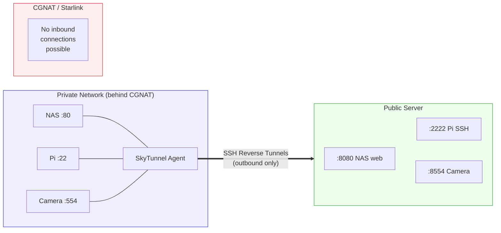
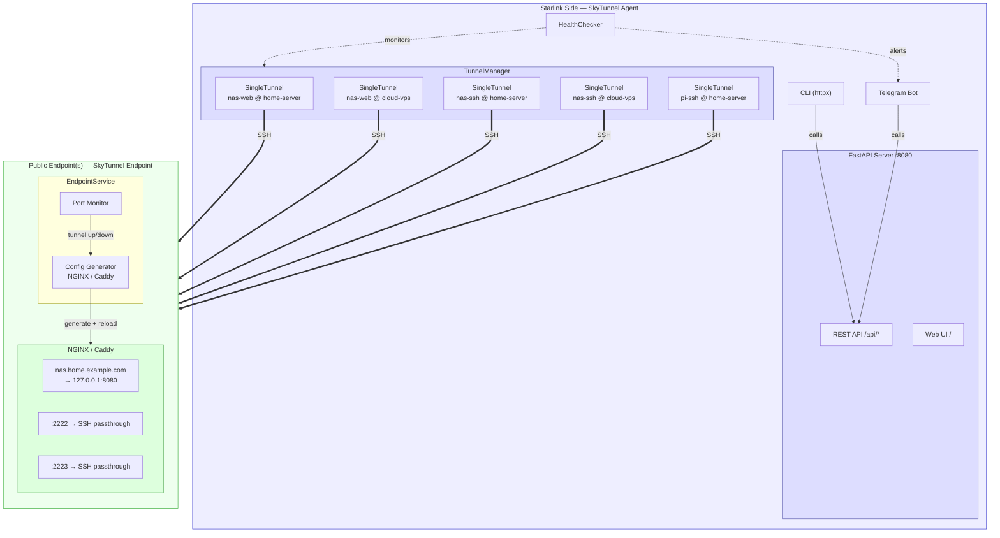
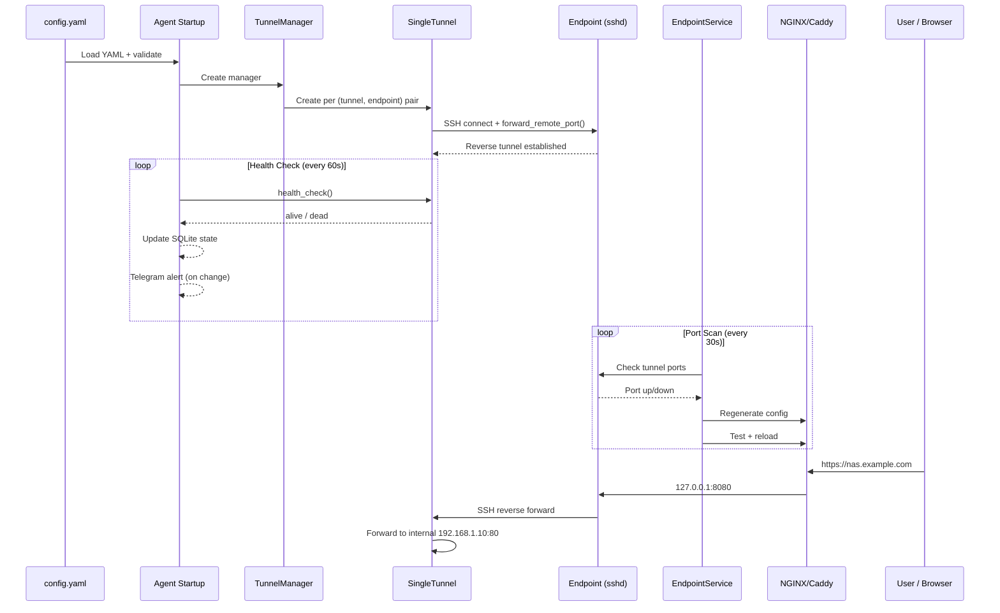
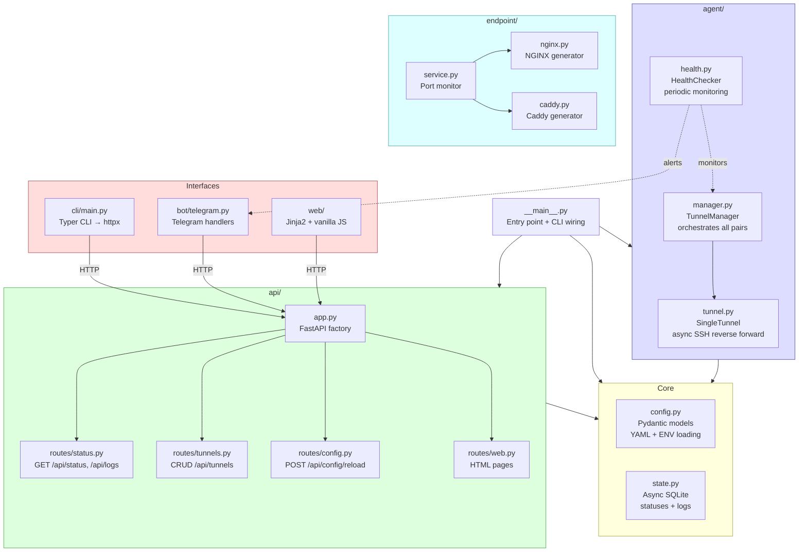
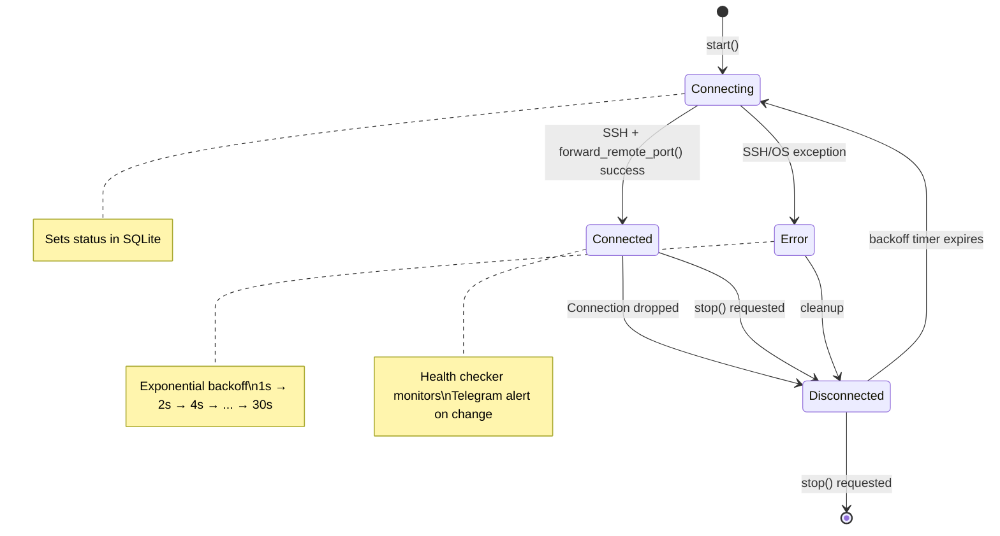
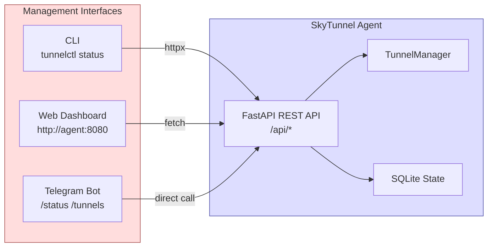
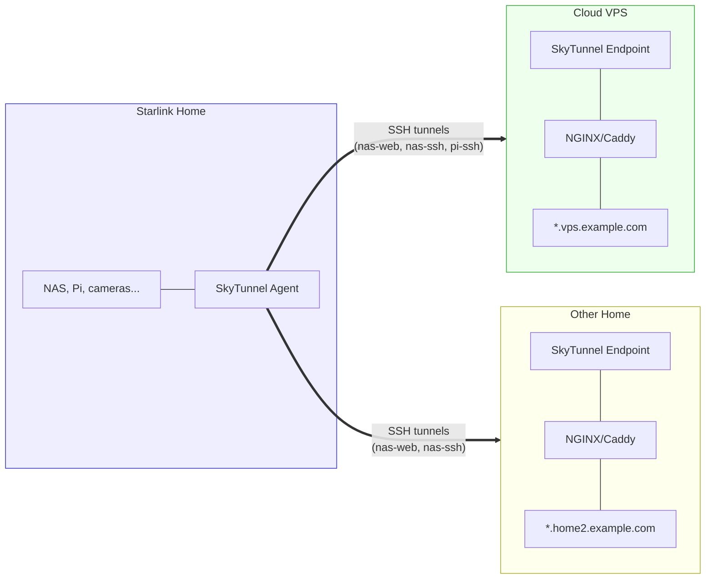
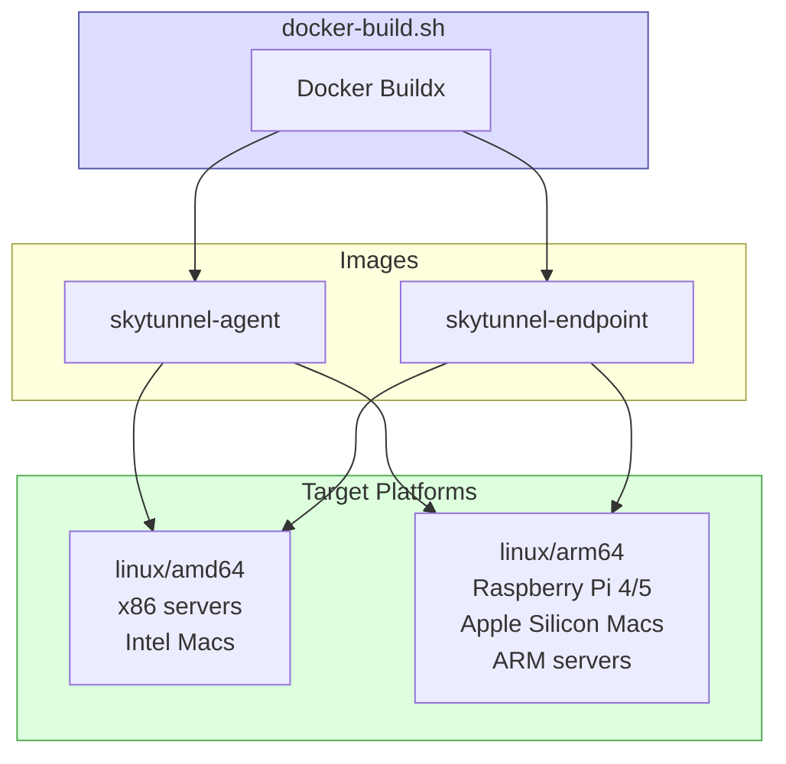

<p align="center">
  
</p>

<h1 align="center">SkyTunnel</h1>

<p align="center">
A reverse tunnel management service for exposing devices behind CGNAT (Starlink, LTE, etc.) to the public internet. Maintains persistent outbound SSH reverse tunnels from your private network to one or more public endpoints, with a web dashboard, CLI, Telegram bot, and automatic reverse proxy configuration.
</p>

---

## Table of Contents

- [How It Works](#how-it-works)
- [Architecture](#architecture)
- [System Requirements](#system-requirements)
- [Installation](#installation)
  - [Quick Install](#quick-install)
  - [Interactive Wizard](#interactive-wizard)
  - [Manual Install](#manual-install)
  - [Docker Install](#docker-install)
- [Configuration](#configuration)
  - [Configuration File Reference](#configuration-file-reference)
  - [Environment Variables](#environment-variables)
  - [Multi-Endpoint Setup](#multi-endpoint-setup)
- [Usage](#usage)
  - [Running the Agent](#running-the-agent)
  - [Running the Endpoint Service](#running-the-endpoint-service)
  - [CLI Commands](#cli-commands)
  - [Web Dashboard](#web-dashboard)
  - [Telegram Bot](#telegram-bot)
- [Deployment Guide](#deployment-guide)
  - [Starlink-Side Deployment](#starlink-side-deployment)
  - [Public Endpoint Deployment](#public-endpoint-deployment)
  - [Multi-Site Deployment](#multi-site-deployment)
  - [Docker Deployment](#docker-deployment)
- [Network Design](#network-design)
- [Security](#security)
- [Troubleshooting](#troubleshooting)
- [Development](#development)

---

## How It Works

SkyTunnel solves a common problem: devices on networks behind Carrier-Grade NAT (CGNAT) — such as Starlink — cannot receive inbound connections. There is no public IP to connect to, and port forwarding is not available.

The solution is **outbound SSH reverse tunnels**. A small agent on your private network initiates SSH connections *outward* to public servers you control. Through these SSH connections, it sets up reverse port forwards that make your internal services accessible on the public server.



**Key capabilities:**

- **Multi-endpoint**: One agent can tunnel to multiple public servers simultaneously. The same set of tunnels is replicated to each endpoint for redundancy or geographic distribution.
- **Auto-reconnect**: Tunnels automatically reconnect with exponential backoff if the SSH connection drops.
- **Health monitoring**: Periodic health checks detect failed tunnels. State changes trigger Telegram alerts.
- **Dynamic management**: Add, remove, or modify tunnels at runtime through the API, CLI, web dashboard, or Telegram bot — no restart required.
- **Reverse proxy**: The endpoint service automatically generates NGINX or Caddy configuration so HTTP services are accessible via subdomains with TLS.

---

## Architecture

SkyTunnel is a single Python package (`tunnelctl`) that runs in different modes depending on which side of the tunnel you are on.

### Component Overview



### Data Flow



1. **Agent starts**: Reads `config.yaml`, creates a `SingleTunnel` for each (tunnel, endpoint) pair, and connects via asyncssh.
2. **SSH reverse forward**: Each `SingleTunnel` opens an SSH connection to the endpoint and calls `forward_remote_port()`, which tells the remote sshd to listen on a port and forward traffic back through the SSH connection to the internal host/port.
3. **Health monitoring**: The `HealthChecker` periodically verifies each tunnel is alive. On state changes (connected/disconnected), it updates the SQLite state store and optionally sends a Telegram alert.
4. **Endpoint service**: On the public server, `tunnelctl endpoint` scans the configured tunnel ports to see which are active, then generates and applies NGINX/Caddy configuration so HTTP services get proper subdomain routing and TCP services are exposed.
5. **Management**: The FastAPI server exposes a REST API. The web dashboard, CLI tool, and Telegram bot all consume this API to show status, add/remove tunnels, and reload config.

### Module Structure



### Tunnel State Machine

Each `SingleTunnel` follows this lifecycle with automatic reconnection:



---

## System Requirements

### Agent (Starlink side)

- Python 3.11+ (or Docker)
- SSH client access to at least one public endpoint
- Network access to internal devices you want to expose
- Runs on: Linux (x86_64, ARM), macOS (Intel, Apple Silicon), Raspberry Pi, Docker

### Endpoint (public server side)

- Python 3.11+ (or Docker)
- SSH server (sshd) running and accessible from the internet
- NGINX or Caddy installed (for reverse proxy)
- A domain name with wildcard DNS (for HTTP subdomain routing)
- Runs on: Linux (x86_64, ARM), macOS, Docker

### Supported Platforms

| Platform | Architecture | Agent | Endpoint |
|----------|-------------|-------|----------|
| Ubuntu/Debian Linux | amd64 | Yes | Yes |
| Ubuntu/Debian Linux | arm64 | Yes | Yes |
| Raspberry Pi OS | arm64/armhf | Yes | Yes |
| macOS | Intel (amd64) | Yes | Yes |
| macOS | Apple Silicon (arm64) | Yes | Yes |
| Docker | amd64, arm64 | Yes | Yes |

---

## Installation

### Quick Install

```bash
git clone <repo-url> && cd proxy_service
bash scripts/install.sh
```

### Interactive Wizard

The wizard walks you through the entire setup process — SSH keys, endpoint configuration, tunnel definitions, Telegram integration, and systemd/launchd service installation.

**For the agent (Starlink side):**

```bash
bash scripts/wizard-agent.sh
```

**For a public endpoint:**

```bash
bash scripts/wizard-endpoint.sh
```

### Manual Install

**1. Install Python dependencies:**

```bash
pip install -e .
```

**2. Create configuration:**

```bash
cp config.example.yaml config.yaml
# Edit config.yaml with your settings
```

**3. Generate SSH keys:**

```bash
bash scripts/setup-keys.sh
# Follow the instructions to copy the public key to each endpoint
```

**4. On each endpoint server, prepare for tunnels:**

```bash
# Create a dedicated tunnel user
sudo useradd -m -s /bin/bash tunnel

# Add the agent's public key
sudo -u tunnel mkdir -p ~tunnel/.ssh
sudo -u tunnel tee ~tunnel/.ssh/authorized_keys < ~/.ssh/tunnel_key.pub
sudo chmod 600 ~tunnel/.ssh/authorized_keys

# Allow reverse port forwarding in sshd
echo 'GatewayPorts clientspecified' | sudo tee -a /etc/ssh/sshd_config
sudo systemctl restart sshd
```

**5. Verify connectivity:**

```bash
tunnelctl check -c config.yaml
```

**6. Start the agent:**

```bash
tunnelctl agent -c config.yaml
```

### Docker Install

**Build multi-architecture images:**

```bash
bash scripts/docker-build.sh
```

**Or pull and run directly:**

```bash
# Agent (Starlink side)
cd docker/agent
cp ../../config.example.yaml config/config.yaml
# Edit config/config.yaml
docker compose up -d

# Endpoint (public server)
cd docker/endpoint
cp ../../config.example.yaml config/config.yaml
# Edit config/config.yaml
docker compose up -d
```

See [Docker Deployment](#docker-deployment) for full details.

---

## Configuration

### Configuration File Reference

SkyTunnel uses a single YAML configuration file. Environment variables can be referenced with `${VAR_NAME}` syntax.

```yaml
# ============================================================================
# Global Settings
# ============================================================================
global:
  # Seconds between reconnect attempts after a tunnel drops.
  # Uses exponential backoff starting at 1s, capped at this value.
  reconnect_interval: 30

  # Seconds between health check sweeps across all tunnels.
  health_check_interval: 60

  # Seconds before a health check probe times out.
  health_check_timeout: 10

  # Logging level: DEBUG, INFO, WARNING, ERROR
  log_level: INFO

  # SQLite database path for storing tunnel statuses and logs.
  # Use ":memory:" for in-memory (no persistence across restarts).
  state_db: ./tunnelctl.db

  # FastAPI server bind address and port.
  # The web dashboard, REST API, CLI, and Telegram bot all use this.
  api_port: 8080
  api_host: 0.0.0.0

# ============================================================================
# Telegram Integration (optional)
# ============================================================================
telegram:
  # Set to true to enable the Telegram bot and alerts.
  enabled: false

  # Bot token from @BotFather. Use env var to keep it out of the file.
  bot_token: "${TELEGRAM_BOT_TOKEN}"

  # Your Telegram chat ID. Message @userinfobot to find it.
  chat_id: "${TELEGRAM_CHAT_ID}"

  # Send alerts when a tunnel disconnects or reconnects.
  alert_on_disconnect: true
  alert_on_reconnect: true

# ============================================================================
# Endpoints — public servers that receive your tunnels
# ============================================================================
# Each endpoint is a server you control with a public IP or domain.
# The agent SSHs to these servers and sets up reverse port forwards.
endpoints:

  - name: home-server              # Unique identifier (used in tunnel config)
    host: home.example.com         # Hostname or IP
    port: 22                       # SSH port
    user: tunnel                   # SSH username
    key_file: ~/.ssh/tunnel_key    # Path to private key

    # Reverse proxy settings (used by the endpoint service on this server)
    proxy:
      type: nginx                  # "nginx" or "caddy"
      http_domain: "*.home.example.com"  # Wildcard domain for HTTP tunnels
      ssl: true                    # Enable TLS (Caddy auto, NGINX needs certbot)
      config_path: /etc/nginx/conf.d/tunnelctl.conf
      reload_command: "nginx -s reload"

  - name: cloud-vps
    host: 203.0.113.50
    port: 22
    user: tunnel
    key_file: ~/.ssh/tunnel_key
    proxy:
      type: caddy
      http_domain: "*.vps.example.com"
      ssl: true

# ============================================================================
# Tunnels — services on your private network to expose
# ============================================================================
# Each tunnel maps an internal host:port to a remote port on one or more
# endpoints. The agent creates one SSH reverse forward per (tunnel, endpoint).
tunnels:

  - name: nas-web                  # Unique name for this tunnel
    internal_host: 192.168.1.10    # IP of the device on your LAN
    internal_port: 5000            # Port the service listens on
    remote_port: 8501              # Port to expose on the public server
    protocol: http                 # "http" or "tcp"
    endpoints: [home-server, cloud-vps]  # Which endpoints to tunnel to
                                   # Empty list [] = all endpoints
    subdomain: nas                 # For HTTP: creates nas.home.example.com

  - name: nas-ssh
    internal_host: 192.168.1.10
    internal_port: 22
    remote_port: 2222
    protocol: tcp                  # Raw TCP forwarding (SSH, databases, etc.)
    endpoints: [home-server, cloud-vps]
    # No subdomain needed for TCP tunnels.
    # Connect with: ssh -p 2222 user@home.example.com

  - name: pi-ssh
    internal_host: 192.168.1.20
    internal_port: 22
    remote_port: 2223
    protocol: tcp
    endpoints: [home-server]       # Only tunnel to home server
```

### Configuration Fields

#### Global

| Field | Type | Default | Description |
|-------|------|---------|-------------|
| `reconnect_interval` | int | 30 | Max seconds between reconnect attempts |
| `health_check_interval` | int | 60 | Seconds between health check sweeps |
| `health_check_timeout` | int | 10 | Timeout for each health probe |
| `log_level` | string | INFO | DEBUG, INFO, WARNING, ERROR |
| `state_db` | string | ./tunnelctl.db | SQLite path, or ":memory:" |
| `api_port` | int | 8080 | REST API / web dashboard port |
| `api_host` | string | 0.0.0.0 | Bind address |

#### Endpoint

| Field | Type | Default | Description |
|-------|------|---------|-------------|
| `name` | string | *required* | Unique identifier |
| `host` | string | *required* | Hostname or IP |
| `port` | int | 22 | SSH port |
| `user` | string | tunnel | SSH username |
| `key_file` | string | ~/.ssh/tunnel_key | Path to SSH private key |
| `proxy.type` | string | nginx | "nginx" or "caddy" |
| `proxy.http_domain` | string | "" | Wildcard domain for subdomains |
| `proxy.ssl` | bool | true | Enable TLS |
| `proxy.config_path` | string | /etc/nginx/conf.d/tunnelctl.conf | Generated config location |
| `proxy.reload_command` | string | nginx -s reload | Command to reload proxy |

#### Tunnel

| Field | Type | Default | Description |
|-------|------|---------|-------------|
| `name` | string | *required* | Unique identifier |
| `internal_host` | string | *required* | LAN IP of the target device |
| `internal_port` | int | *required* | Port on the target device |
| `remote_port` | int | *required* | Port to expose on endpoint(s) |
| `protocol` | string | tcp | "tcp" or "http" |
| `endpoints` | list | [] (=all) | Which endpoints to tunnel to |
| `subdomain` | string | null | HTTP subdomain (e.g. "nas") |

### Environment Variables

Secrets should be kept out of the YAML file using `${VAR_NAME}` interpolation:

```bash
# .env file
TELEGRAM_BOT_TOKEN=7123456789:AAHxxxxx
TELEGRAM_CHAT_ID=123456789
```

Load before running: `source .env && export TELEGRAM_BOT_TOKEN TELEGRAM_CHAT_ID`

Or use the Docker `env_file` directive.

### Multi-Endpoint Setup

A single agent can maintain tunnels to multiple public servers. This is useful for:

- **Redundancy**: If one endpoint goes down, services are still reachable via the other.
- **Geographic distribution**: Place endpoints in different regions for lower latency.
- **Access control**: Expose different services to different networks.

Each tunnel specifies which endpoints it targets:

```yaml
tunnels:
  - name: nas-web
    internal_host: 192.168.1.10
    internal_port: 80
    remote_port: 8080
    protocol: http
    endpoints: [home-server, cloud-vps]   # Replicated to both
    subdomain: nas

  - name: printer
    internal_host: 192.168.1.30
    internal_port: 631
    remote_port: 6310
    protocol: tcp
    endpoints: [home-server]              # Only at home
```

The agent creates one SSH connection per (tunnel, endpoint) pair. In the example above, `nas-web` produces two SSH connections (one to each endpoint), while `printer` produces one.

---

## Usage

All SkyTunnel management interfaces share the same FastAPI backend:



### Running the Agent

The agent is the main daemon that runs on the Starlink side. It starts all tunnel connections, the health checker, the FastAPI server (API + web dashboard), and optionally the Telegram bot.

```bash
# Start with default config.yaml
tunnelctl agent

# Specify a config file
tunnelctl agent -c /path/to/config.yaml
```

The agent runs in the foreground and logs to stdout. Use a process manager (systemd, launchd, Docker) for production.

### Running the Endpoint Service

The endpoint service runs on the public-facing server. It monitors which tunnel ports are active and regenerates the reverse proxy configuration.

```bash
tunnelctl endpoint -c /path/to/config.yaml
```

The endpoint service periodically scans the configured tunnel ports. When it detects a tunnel coming up or going down, it regenerates and reloads the NGINX or Caddy configuration.

### CLI Commands

The CLI talks to the running agent's API over HTTP. By default it connects to `http://localhost:8080`.

```bash
# Show tunnel statuses
tunnelctl status
tunnelctl status --endpoint home-server

# List configured tunnels
tunnelctl tunnels list

# Add a tunnel at runtime (persisted to config.yaml)
tunnelctl tunnels add \
  --name camera-web \
  --host 192.168.1.50 \
  --port 8080 \
  --remote-port 8502 \
  --protocol http \
  --endpoints home-server,cloud-vps \
  --subdomain camera

# Remove a tunnel
tunnelctl tunnels remove --name camera-web

# Verify SSH connectivity to all endpoints
tunnelctl check -c config.yaml

# Reload configuration (picks up YAML changes without restart)
tunnelctl reload

# View recent logs
tunnelctl logs
tunnelctl logs --limit 100 --tunnel nas-web

# Point CLI at a remote agent
tunnelctl status --api http://192.168.1.5:8080
```

### Web Dashboard

The web dashboard is served by the agent at `http://<agent-host>:8080`.

- **Dashboard** (`/`): Live status table of all tunnels, auto-refreshes every 5 seconds. Color-coded status badges (green=connected, yellow=connecting, red=disconnected).
- **Tunnels** (`/tunnels`): Add, edit, and remove tunnel definitions. Changes are applied immediately and persisted to the config file.
- **Logs** (`/logs`): Real-time log viewer, auto-refreshes every 10 seconds.

### Telegram Bot

Set up Telegram integration for remote SkyTunnel monitoring and management from your phone.

**Setup:**

1. Message [@BotFather](https://t.me/BotFather) on Telegram, send `/newbot`, follow prompts.
2. Copy the bot token.
3. Message your new bot, then get your chat ID:
   ```bash
   curl -s "https://api.telegram.org/bot<TOKEN>/getUpdates" | python3 -m json.tool | grep '"id"'
   ```
4. Add to config:
   ```yaml
   telegram:
     enabled: true
     bot_token: "${TELEGRAM_BOT_TOKEN}"
     chat_id: "${TELEGRAM_CHAT_ID}"
   ```

**Commands:**

| Command | Description |
|---------|-------------|
| `/status` | Show all tunnel statuses with icons |
| `/tunnels` | List configured tunnels |
| `/add name host port remote_port [protocol]` | Add a tunnel |
| `/remove name` | Remove a tunnel |
| `/logs` | Show last 10 log entries |

**Alerts:**

The bot sends automatic notifications when tunnels change state:
- Disconnect: `tunnel_name@endpoint` went from connected to disconnected
- Reconnect: `tunnel_name@endpoint` recovered

---

## Deployment Guide

### Starlink-Side Deployment

This is the machine on your Starlink (or other CGNAT) network that runs the agent.

**Option A: Systemd service (Linux / Raspberry Pi)**

```bash
# Run the wizard, which creates the service for you:
bash scripts/wizard-agent.sh

# Or manually create the service:
sudo tee /etc/systemd/system/tunnelctl-agent.service << EOF
[Unit]
Description=SkyTunnel tunnel agent
After=network-online.target
Wants=network-online.target

[Service]
Type=simple
User=$USER
WorkingDirectory=$(pwd)
ExecStart=$(which tunnelctl) agent -c $(pwd)/config.yaml
Restart=always
RestartSec=10
EnvironmentFile=$(pwd)/.env

[Install]
WantedBy=multi-user.target
EOF

sudo systemctl daemon-reload
sudo systemctl enable --now tunnelctl-agent
```

**Option B: launchd plist (macOS)**

```bash
# Run the wizard, which creates the plist for you:
bash scripts/wizard-agent.sh

# Or manually:
cat > ~/Library/LaunchAgents/com.tunnelctl.agent.plist << EOF
<?xml version="1.0" encoding="UTF-8"?>
<!DOCTYPE plist PUBLIC "-//Apple//DTD PLIST 1.0//EN" "http://www.apple.com/DTDs/PropertyList-1.0.dtd">
<plist version="1.0">
<dict>
    <key>Label</key><string>com.tunnelctl.agent</string>
    <key>ProgramArguments</key>
    <array>
        <string>$(which tunnelctl)</string>
        <string>agent</string>
        <string>-c</string>
        <string>$(pwd)/config.yaml</string>
    </array>
    <key>RunAtLoad</key><true/>
    <key>KeepAlive</key><true/>
    <key>StandardOutPath</key><string>/tmp/tunnelctl-agent.log</string>
    <key>StandardErrorPath</key><string>/tmp/tunnelctl-agent.log</string>
</dict>
</plist>
EOF

launchctl load ~/Library/LaunchAgents/com.tunnelctl.agent.plist
```

**Option C: Docker**

```bash
cd docker/agent
# Put your config.yaml in config/ and SSH keys in ssh/
docker compose up -d
```

### Public Endpoint Deployment

This is the machine with a public IP that receives the tunnels and runs the reverse proxy.

**1. Prepare sshd for tunnel forwarding:**

```bash
# Create a dedicated user
sudo useradd -m -s /bin/bash tunnel

# Add the agent's public key
sudo -u tunnel mkdir -p ~tunnel/.ssh
cat agent_tunnel_key.pub | sudo -u tunnel tee ~tunnel/.ssh/authorized_keys
sudo chmod 600 ~tunnel/.ssh/authorized_keys

# Enable GatewayPorts so tunnels bind to all interfaces
sudo sed -i 's/#GatewayPorts no/GatewayPorts clientspecified/' /etc/ssh/sshd_config
sudo systemctl restart sshd
```

**2. Install and configure NGINX (or Caddy):**

```bash
# NGINX
sudo apt install nginx
# Ensure /etc/nginx/nginx.conf includes stream{} block:
# Add to the bottom of nginx.conf:
#   stream { include /etc/nginx/conf.d/*.stream.conf; }

# Or Caddy (handles TLS automatically):
sudo apt install caddy
```

**3. Run the endpoint service:**

```bash
# Wizard:
bash scripts/wizard-endpoint.sh

# Or manually:
tunnelctl endpoint -c config.yaml
```

**4. DNS setup:**

For HTTP tunnels with subdomain routing, point a wildcard DNS record at your endpoint:

```
*.home.example.com  A  203.0.113.50
```

### Multi-Site Deployment

For a typical multi-site setup (Starlink home + cloud VPS + another home):



Config on the agent:

```yaml
endpoints:
  - name: cloud-vps
    host: vps.example.com
    ...
  - name: other-home
    host: home2.example.com
    ...

tunnels:
  - name: nas-web
    endpoints: [cloud-vps, other-home]  # Available at both
    ...
  - name: pi-ssh
    endpoints: [cloud-vps]              # Only on VPS
    ...
```

### Docker Deployment



**Build images for all platforms:**

```bash
# Build and push multi-arch images
bash scripts/docker-build.sh

# Or build locally for current platform only
bash scripts/docker-build.sh --local
```

**Agent (Starlink side):**

```bash
cd docker/agent
mkdir -p config ssh

# Copy your config and SSH keys
cp ../../config.yaml config/
cp ~/.ssh/tunnel_key ssh/
cp ~/.ssh/tunnel_key.pub ssh/

# Create .env for Telegram (optional)
echo "TELEGRAM_BOT_TOKEN=..." > .env
echo "TELEGRAM_CHAT_ID=..." >> .env

docker compose up -d
docker compose logs -f
```

**Endpoint (public server):**

```bash
cd docker/endpoint
mkdir -p config

cp ../../config.yaml config/

docker compose up -d
docker compose logs -f
```

---

## Network Design

### Port Allocation Strategy

For a clean setup, establish a convention for remote port numbers:

| Range | Purpose | Example |
|-------|---------|---------|
| 2200-2299 | SSH access | 2201=NAS, 2202=Pi, 2203=server |
| 8500-8599 | HTTP services | 8501=NAS web, 8502=cameras, 8503=dashboard |
| 8600-8699 | HTTPS services | 8601=Home Assistant |
| 9000-9099 | Databases | 9001=Postgres, 9002=Redis |

### Firewall Rules (Endpoint)

On the public endpoint, open only the ports you need:

```bash
# SSH for tunnel connections
sudo ufw allow 22/tcp

# HTTP/HTTPS for reverse proxy
sudo ufw allow 80/tcp
sudo ufw allow 443/tcp

# Tunnel ports (adjust range to your needs)
sudo ufw allow 2200:2299/tcp
sudo ufw allow 8500:8599/tcp
```

### Connecting Through Tunnels

**SSH to an internal device:**

```bash
# Direct SSH through TCP tunnel
ssh -p 2222 user@home.example.com

# With ProxyJump for convenience in ~/.ssh/config:
Host nas
    HostName home.example.com
    Port 2222
    User admin
```

**HTTP services:**

```
# Access via subdomain (requires DNS + proxy)
https://nas.home.example.com

# Or directly via port
http://home.example.com:8501
```

---

## Security

### SSH Key Management

- **Use dedicated keys**: Generate a separate key pair for SkyTunnel, not your personal SSH key.
- **Restrict the tunnel user**: On endpoints, the `tunnel` user only needs to create reverse forwards. You can restrict it in `authorized_keys`:
  ```
  restrict,port-forwarding ssh-ed25519 AAAA... skytunnel
  ```
  The `restrict` option disables shell access, agent forwarding, etc. `port-forwarding` re-enables only port forwarding.

### API Security

- The web dashboard and API bind to `0.0.0.0:8080` by default. In production, either:
  - Bind to `127.0.0.1` and access via SSH tunnel or VPN
  - Place behind a reverse proxy with authentication
  - Use a firewall to restrict access

### Telegram Bot

- The bot only responds to messages from the configured `chat_id`, rejecting all others.
- Keep `bot_token` in an environment variable, not the config file.

---

## Troubleshooting

### Tunnels stuck in "connecting"

1. Check SSH connectivity: `tunnelctl check -c config.yaml`
2. Test manually: `ssh -i ~/.ssh/tunnel_key tunnel@endpoint-host`
3. Check the agent logs: `tunnelctl logs` or look at stdout
4. Verify the key file path in config is correct

### Tunnels connect but traffic doesn't flow

1. On the endpoint, check the port is listening: `ss -tlnp | grep <remote_port>`
2. Verify `GatewayPorts clientspecified` in endpoint's `/etc/ssh/sshd_config`
3. Check firewall rules on the endpoint
4. Test locally on the endpoint: `curl http://127.0.0.1:<remote_port>`

### NGINX returns 502

1. The tunnel may have disconnected — check `tunnelctl status`
2. Verify NGINX config: `nginx -t`
3. Check NGINX logs: `tail -f /var/log/nginx/error.log`

### Telegram bot not responding

1. Verify `enabled: true` in config
2. Check the bot token is correct: `curl https://api.telegram.org/bot<TOKEN>/getMe`
3. Verify your chat ID: send a message to the bot, then check `/getUpdates`
4. Check agent logs for Telegram errors

### Agent won't start (YAML error)

1. Validate your YAML: `python3 -c "import yaml; yaml.safe_load(open('config.yaml'))"`
2. Common issue: inconsistent indentation (mix of tabs and spaces)
3. Ensure environment variables in `${VAR}` syntax are properly quoted

---

## Development

### Setup

```bash
pip install -e ".[dev]"
```

### Running Tests

```bash
# All tests
python3 -m pytest tests/ -v

# Single file
python3 -m pytest tests/test_config.py -v

# Single test
python3 -m pytest tests/test_api.py::test_list_tunnels -v
```

### Linting

```bash
ruff check src/ tests/
mypy src/
```

### Local Testing

Test the full SkyTunnel system on one machine using localhost SSH:

```bash
# Terminal 1: Start mock service + generate test config
bash scripts/local-test.sh

# Terminal 2: Start the agent
tunnelctl agent -c config.local-test.yaml

# Terminal 3: Verify
curl http://127.0.0.1:9998          # HTTP tunnel
ssh -p 9996 $USER@127.0.0.1        # SSH tunnel
open http://127.0.0.1:8080          # Web dashboard
tunnelctl status                    # CLI status
```

### Project Structure

See [Architecture](#architecture) for a full breakdown of the module structure and data flow.
